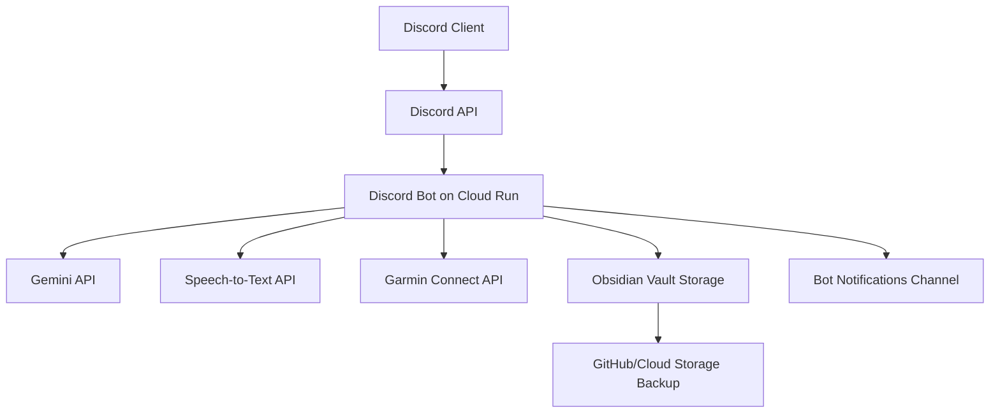
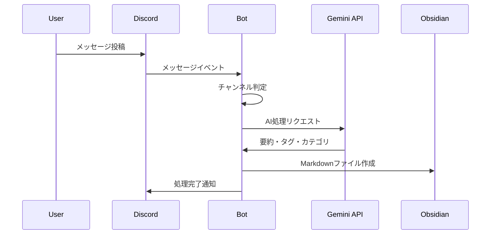
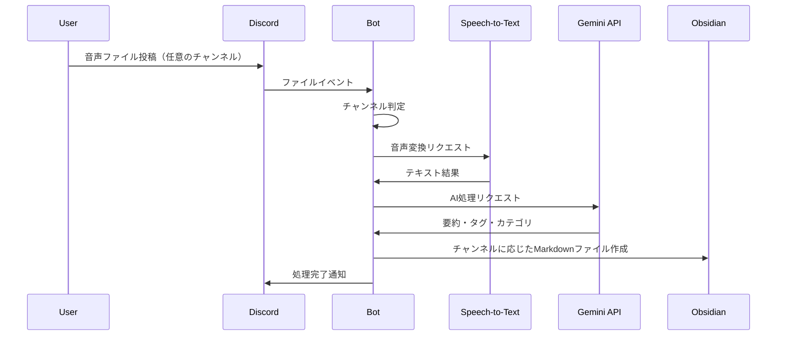
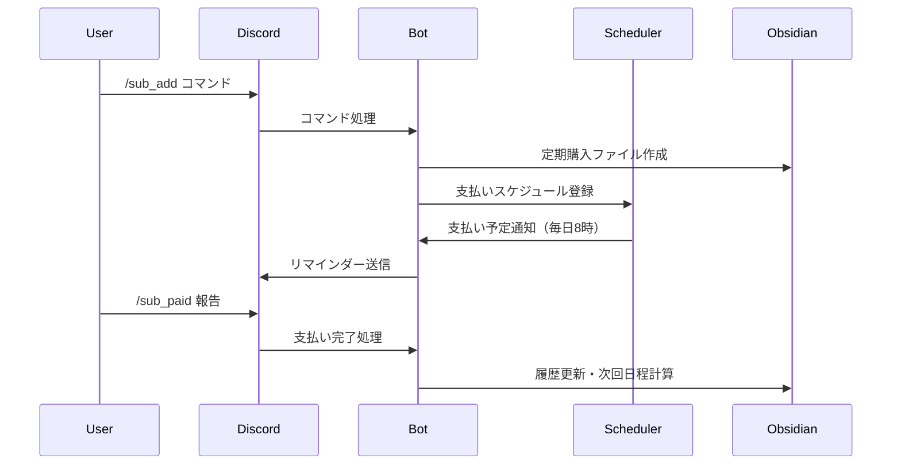
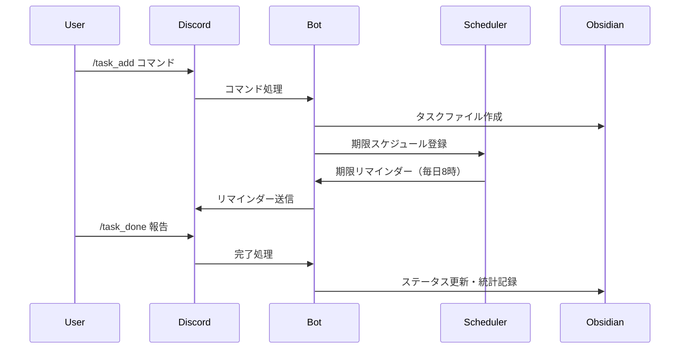

# 設計書

## 概要

Discord-Obsidianメモボットは、Discordをメモ入力インターフェースとし、Google Gemini APIによるAI処理を経てObsidianに自動保存する個人用ナレッジマネジメントシステムです。Google Cloud Runの無料枠を活用し、24時間365日稼働する設計となっています。

## アーキテクチャ

### システム全体構成



### 主要コンポーネント

#### 1. Discord Bot Core
- **責任**: Discordイベントの監視と処理
- **技術**: Discord.py
- **機能**:
  - メッセージ監視
  - コマンド処理
  - ファイル添付処理
  - 音声ファイル検知

#### 2. AI Processing Engine
- **責任**: メモの要約・分類・関連性分析
- **技術**: Google Gemini API (google-generativeai)
- **機能**:
  - テキスト要約
  - キーワード抽出・タグ生成
  - カテゴリ分類
  - 関連ノート提案
  - URL内容要約

#### 3. Voice Processing Module
- **責任**: 音声メモのテキスト変換
- **技術**: Google Cloud Speech-to-Text API
- **機能**:
  - 音声ファイル検知
  - 音声→テキスト変換
  - 使用量追跡

#### 4. Obsidian Integration Layer
- **責任**: Obsidianファイルの作成・管理
- **技術**: ファイルシステム操作、Markdownテンプレート
- **機能**:
  - Markdownファイル生成
  - フォルダ分類
  - テンプレート適用
  - メタデータ付与

#### 5. Health Data Collector
- **責任**: Garminデータの取得・統合
- **技術**: python-garminconnect
- **機能**:
  - 健康データ取得
  - デイリーノート統合
  - データ分析

#### 6. Finance Management Module
- **責任**: 定期購入・家計管理
- **技術**: スケジューラー、データ永続化
- **機能**:
  - 定期購入サービス管理
  - 支払いリマインダー
  - 収支トラッキング
  - 予算管理・警告

#### 7. Task & Schedule Manager
- **責任**: タスク・スケジュール管理
- **技術**: スケジューラー、進捗トラッキング
- **機能**:
  - タスク作成・管理
  - スケジュール管理
  - リマインダー送信
  - 進捗統計

#### 8. Storage & Backup Manager
- **責任**: データの永続化とバックアップ
- **技術**: Google Cloud Storage, GitHub API
- **機能**:
  - ファイル永続化
  - 定期バックアップ
  - 同期管理

## データフロー

### 1. メモ処理フロー



### 2. 音声メモ処理フロー



### 3. 家計管理フロー



### 4. タスク管理フロー



## コンポーネント設計

### Discord Bot Core

```python
class DiscordBot:
    def __init__(self):
        self.client = discord.Client()
        self.ai_processor = AIProcessor()
        self.obsidian_manager = ObsidianManager()
        self.voice_processor = VoiceProcessor()

    async def on_message(self, message):
        # チャンネル判定とメッセージ処理

    async def on_voice_message(self, message):
        # 音声ファイル処理（全チャンネル対応）

    async def process_command(self, command):
        # コマンド処理 (/help, /status, /search等)
```

### AI Processing Engine

```python
class AIProcessor:
    def __init__(self):
        self.gemini_client = genai.GenerativeModel('gemini-pro')
        self.usage_tracker = UsageTracker()

    async def process_memo(self, text: str) -> MemoMetadata:
        # 要約・タグ・カテゴリ生成

    async def find_related_notes(self, text: str, vault_path: str) -> List[str]:
        # 関連ノート検索

    async def summarize_url(self, url: str) -> str:
        # URL内容要約
```

### Obsidian Integration Layer

```python
class ObsidianManager:
    def __init__(self, vault_path: str):
        self.vault_path = vault_path
        self.template_manager = TemplateManager()

    def create_note(self, metadata: MemoMetadata, content: str) -> str:
        # Markdownファイル作成

    def append_to_daily_note(self, date: str, section: str, content: str):
        # デイリーノートへの追記

    def organize_by_folder(self, channel: str, category: str) -> str:
        # フォルダ分類決定
```

### Finance Management Module

```python
class FinanceManager:
    def __init__(self, vault_path: str):
        self.vault_path = vault_path
        self.scheduler = ScheduleManager()

    def add_subscription(self, service: str, amount: int, cycle: str, next_date: str) -> str:
        # 定期購入サービス追加

    def check_payment_due(self) -> List[PaymentReminder]:
        # 支払い予定チェック

    def record_payment(self, service: str) -> None:
        # 支払い記録・次回日程更新

    def track_expense(self, amount: int, category: str, description: str) -> None:
        # 支出記録

    def generate_finance_report(self, period: str) -> str:
        # 家計レポート生成
```

### Task & Schedule Manager

```python
class TaskManager:
    def __init__(self, vault_path: str):
        self.vault_path = vault_path
        self.scheduler = ScheduleManager()

    def create_task(self, name: str, deadline: str, priority: str, description: str) -> str:
        # タスク作成

    def update_task_progress(self, task_name: str, progress: int) -> None:
        # 進捗更新

    def complete_task(self, task_name: str) -> None:
        # タスク完了

    def check_task_deadlines(self) -> List[TaskReminder]:
        # 期限チェック

    def create_schedule(self, event: str, datetime: str, location: str, description: str) -> str:
        # スケジュール作成

    def generate_task_stats(self, period: str) -> TaskStatistics:
        # タスク統計生成
```

## データモデル

### MemoMetadata

```python
@dataclass
class MemoMetadata:
    timestamp: datetime
    channel: str
    user_id: str
    summary: str
    tags: List[str]
    category: str
    related_notes: List[str]
    file_attachments: List[str]
```

### ObsidianNote

```python
@dataclass
class ObsidianNote:
    filename: str
    folder_path: str
    frontmatter: Dict[str, Any]
    content: str
    template_type: str
```

### SubscriptionService

```python
@dataclass
class SubscriptionService:
    name: str
    amount: int
    cycle: str  # monthly, yearly, weekly
    next_payment_date: datetime
    status: str  # active, paused, cancelled
    category: str
    payment_history: List[PaymentRecord]
```

### Task

```python
@dataclass
class Task:
    name: str
    description: str
    deadline: datetime
    priority: str  # high, medium, low
    status: str  # active, completed, cancelled
    progress: int  # 0-100
    created_date: datetime
    completed_date: Optional[datetime]
    category: str
```

### Schedule

```python
@dataclass
class Schedule:
    event_name: str
    datetime: datetime
    location: str
    description: str
    status: str  # scheduled, completed, cancelled
    reminders_sent: List[datetime]
```

## エラーハンドリング

### API制限対応

```python
class APILimitHandler:
    def __init__(self):
        self.gemini_usage = UsageTracker('gemini')
        self.speech_usage = UsageTracker('speech')

    async def check_limits(self) -> bool:
        # 使用量チェック

    async def queue_for_later(self, task: ProcessingTask):
        # 制限時のキューイング

    async def fallback_processing(self, memo: str) -> MemoMetadata:
        # AI処理なしの基本保存
```

### 復旧機能

```python
class RecoveryManager:
    async def process_queued_messages(self):
        # 未処理メッセージの処理

    async def backup_vault(self):
        # Vaultのバックアップ

    async def sync_with_github(self):
        # GitHubとの同期
```

## テスト戦略

### 単体テスト
- 各コンポーネントの独立テスト
- モックを使用したAPI呼び出しテスト
- エラーケースのテスト

### 統合テスト
- Discord → Obsidian の完全フロー
- API制限時の動作確認
- バックアップ・復旧機能

### 負荷テスト
- 大量メッセージ処理
- API制限到達時の動作
- メモリ使用量の監視

## セキュリティ設計

### 認証情報管理
- Google Cloud Secret Manager使用
- 環境変数での設定
- トークンの定期ローテーション

### データ保護
- 個人情報の暗号化
- アクセスログの記録
- 不正アクセス検知

## パフォーマンス最適化

### Cloud Run最適化
- コールドスタート時間の最小化
- メモリ使用量の最適化
- 並行処理の実装

### API使用量最適化
- バッチ処理の活用
- キャッシュ機能
- 優先度ベースの処理

## 監視・ログ

### システム監視
- Cloud Run メトリクス
- API使用量追跡
- エラー率監視

### ログ設計
- 構造化ログ
- レベル別ログ出力
- Discord通知連携
